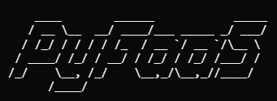

 
     

# What
PyFaaS is a minimal, lightweight, and easy to use Python library for remote function execution (FaaS, Function as a Service).  
Upon deploying a function to a worker, the user is able to then invoke the function to be executed on such worker, receiving back the result.

# Installation guide

## Requirements

## Installation

# Configuring the client and the worker

# Examples
